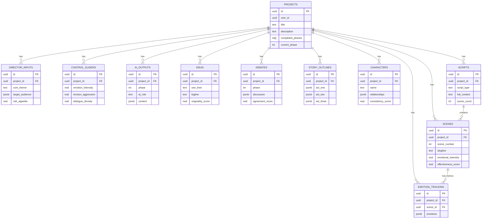

# AI Director Assistant — DB ERD

This file contains a high-level ERD (Mermaid) and notes for the core schema implemented in
`supabase/migrations/20251227053429_001_create_core_tables.sql`.

Notes:
- RLS policies are applied in the main migration; the ERD focuses on relationships and cardinality.
- Use the sample seed SQL in `supabase/migrations/20251227060500_002_seed_core_tables.sql` to populate a dev project and verify queries.
- Acceptance criteria for Task 1: ERD reviewed, seed migration exists, and local dev DB can be seeded with sample data.
